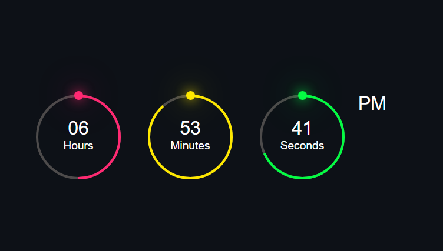

# Clock-Project

### This project is a simple yet elegant digital clock implemented using HTML, CSS, and JavaScript. It displays the current time with hours, minutes, and seconds, and indicates whether it's AM or PM. The clock also features animated circular progress indicators for hours, minutes, and seconds.

## Features
### Displays the current time in hours, minutes, and seconds. Indicates AM/PM. Animated circular progress indicators for hours, minutes, and seconds. Responsive design with a clean and modern UI.

